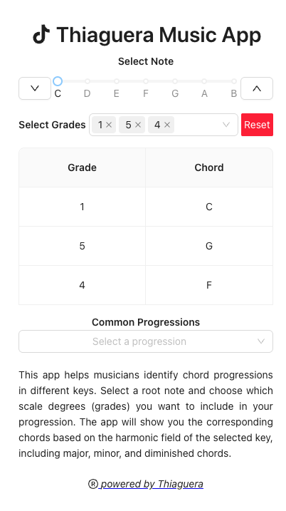

# Thiaguera Music App

[Access App in Prod](https://music-app-flame-five.vercel.app/)

Thiaguera Music App is a powerful tool designed for musicians and music enthusiasts to explore and create chord progressions in various keys. With an intuitive interface, you can:

- Select a root note to define your key.
- Choose specific scale degrees to include in your progression.
- Instantly view the corresponding chords, including major, minor, and diminished variations, based on the harmonic field of the selected key.

Whether you're composing, practicing, or learning music theory, this app simplifies the process of understanding and building chord progressions.

